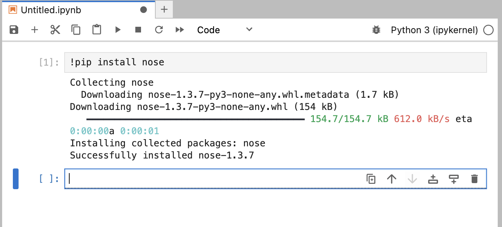

# Python Exam 2

It consists of 5 jupyter notebooks. Each one has a coding problem that must be written.
When the code is written correctly, the unit test at the bottom of the notebook will
complete with no errors of any kind.

Already unimplemented method(s) exist in each part, places where you put your method
code to pass the tests.

*Normal rules: you may not consult with any other person on this exam, and you cannot use
anyone else's code or solutions to these problem. You may google etc, if you need to, to complete
them.*

__SETUP JupyterLab to use python version `3.9.6` (it is NOT okay to use python 3.12.*)__

Step thru the notebook, running each cell. Remember to run the code cells after you have changed the one
with your code solution in it. (otherwise it uses the previous version!)

You see how many tests you pass by running the last cell in each part.

Obviously, with four parts, and only a few tests, grading is going be interesting.

- Part 0 : 10 tests
- Part 1 : 12 tests
- Part 2 : 9 tests
- Part 3 : 4 tests
- Part 4 : 5 tests

        40 is a perfect score.

When you start, fork and clone. Make a simple change. Use git to commit that simple change.
Push it to your repo. 
Then, Create a Pull Request right now! That way you won't forget. (and as you continue to 
work, commit and push about every half hour, it will keep the pull Request up to date). 
We need to see several "steps" along the way of your progression thru the problems.

**You must get at least two of the parts correct to pass.** But at this point,
we tend to think you should be able to *do 4 of the 5*, no matter what, in the time period given.

When you open these notebooks in JupyterLab, you will probably need to `!pip install nose` (please! notice the ! the exclaimation point at the beginning of that command. That means "run the command in a shell")

